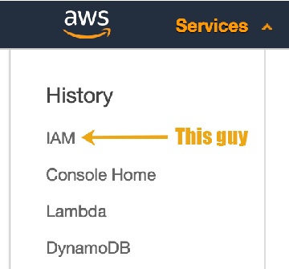
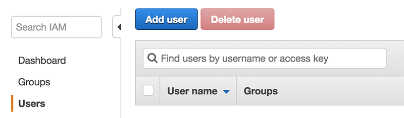
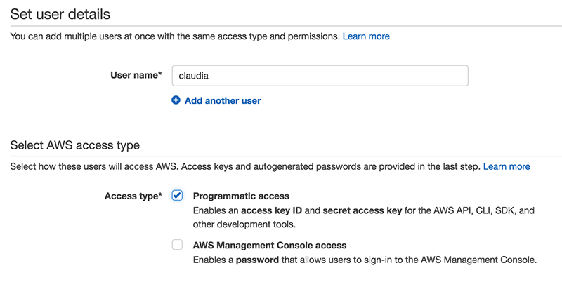
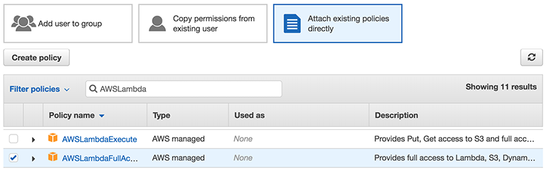
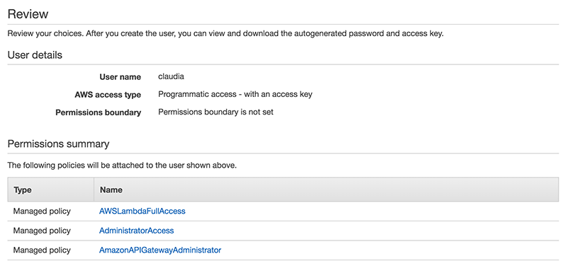
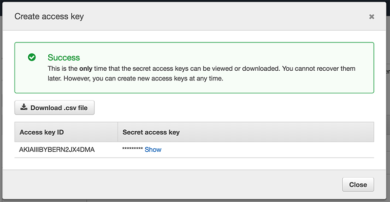

# Setting up an IAM account for Claudia

`claudia` needs to access your `AWS` account in order to manage your `Lambda` deployments. You will need to create an `IAM` account and store those credentials on your local machine.

## Wut?

I know! But it's not so hard.

Head to `AWS` and visit the `IAM` service:


----

When you land, click `Add User`


----

And create a new user named `claudia` (you can use any name but this is a good one for this project!)

You will give this user programmatic access...`claudia` will be accessing the `AWS` API.


----

Great. What sort of permissions should `claudia` have? Click `Permissions`, select `Attach existing policies directly`, and add the following permissions your `claudia` identity:

	+ AdministratorAccess
	+ AmazonAPIGatewayAdministrator
	+ AWSLambdaFullAccess

(Use the handly search tool!)


----

Once you're done with permissions click `Review` and you should see something like this:


----

Hit `Create User` and you're done.

Head back to the main `IAM` administration page and click your new `claudia` user. You're going to want to `Create Access Key`. When these are generated a modal will pop up containing your keys. 



You'll need both the public and secret key to work with `claudia`. These will be stored on your local system. A good pattern here is to store an AWS configuration file in your home directory (on OSX, this would be `/Users/<yourusername>`; Windows `C:\Users\<yourusername>`). Visit your home directory, and create a `.aws/credentials` file with the keys for your shiny new `claudia`:

```
[claudia]
aws_access_key_id = <YOUR_ACCESS_KEY>
aws_secret_access_key = <YOUR_ACCESS_SECRET>
```

You're done. `claudia` will automatically fetch these credentials whenever it is run.

Next...[did it work?](./did_it_work.md)


