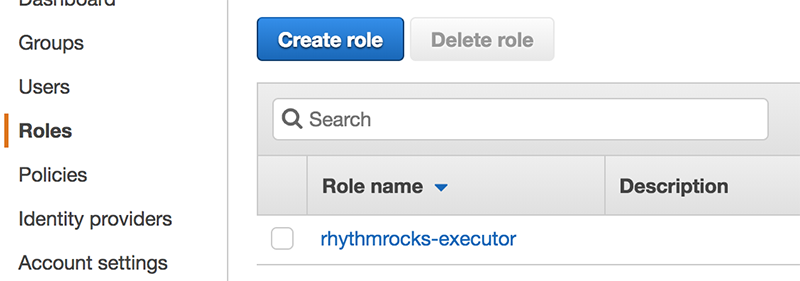
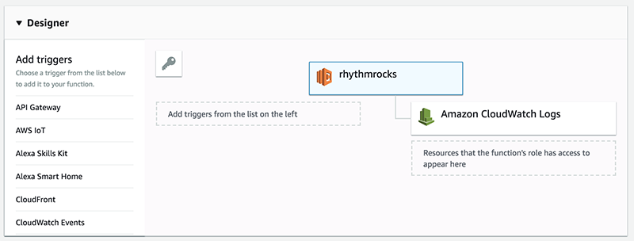
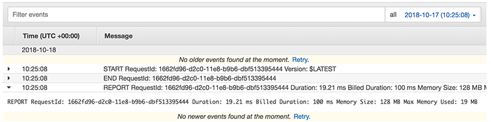
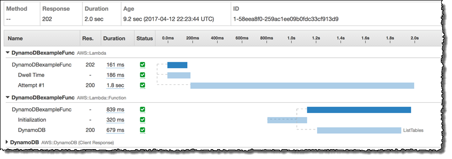

# Did it work?

To find out let's try to create a `Lambda` function!

`claudia` works on the idea of deploying a package, just like with `npm`. So to start we create a folder, and `npm init`:

```
mkdir rhythmrocks
cd rhythmrocks
npm init
```

Now the good stuff -- your first `Lambda` function!

Create a new file called `lambda.js` in the `rhythmrocks` folder with this content:

```
exports.handler = function (event, context) {
	context.succeed('InRhythm Rocks!');
};
```

We're exporting a function with a name -- here, `handler` -- just like with `node`. We could also do this:

```
exports.sillyname = function (event, context) {
	...
};
```

Ok, we have our function to deploy. Let's do that -- run this command:

```
claudia create --region us-east-1 --profile claudia --handler lambda.handler
```

No errors? Great! You just created your first `Lambda` function. 

## What do those arguments mean?

- **--region us-east-1** : The AWS availability zone this lambda function run within
- **profile claudia** : You are identifying the configuration group to use in your `.aws/configuration` file
- **handler lambda.handler** : Here you are identifying the file to deploy (minus the `.js`) and the name of the handler you've exported. In our case `lambda.js` and `handler` (remember `exports.handler`?), so `lambda.handler`

A couple of things have happened in the background:

1. A `claudia.json` file was created in this folder. Not something you need to worry about, but necessary for `claudia` to do its work.
2. An `executor role` was created on `AWS` for this `Lambda`, taking the `name` in our `package.json` file:



# Updating

```
claudia update --profile claudia
```

# Triggering

`Lambda` functions, like any function, need to be triggered:



Spend a little time going over the AWS dashboard for your `Lambda`. You can edit them right there, manage stats, set triggers, and so on. Of course using `claudia` is easier, but it's important to note that no matter how badly your local build fails you always have the failsafe of using the AWS dashboard directly to change, remove, or otherwise manage your `Lambda` fleet.

Again, these are functions to be triggered. The simplest way to trigger a `Lambda` function is to send it an event. You do this using a JSON object. 

To see this in action let's modify our function:

```
exports.handler = (event, context) => {
	context.succeed(`Hello ${event.name}!`);
};

```

And update: `claudia update`.

The first argument to a `Lambda` is info about the triggering event. Let's use `claudia` to trigger our function with an event object.

If we have a file `event.json`:

```
{
  "name": "Sandro"
}
```

Then we can do this:

```
claudia test-lambda --event event.json --profile claudia
```

And we get:

```
{
  "StatusCode": 200,
  "ExecutedVersion": "$LATEST",
  "Payload": "\"Hello Sandro!\""
}
```

## CloudWatch

Logs are built in with AWS `Lambda`, via the `CloudWatch` service:



You can use this service to monitor your lambda execution, receiving information on each execution, similar to:

```
REPORT RequestId: a9502ec4-d2e8-11e8-b998-d3d3349bcb3a	Duration: 12.44 ms	Billed Duration: 100 ms Memory Size: 128 MB	Max Memory Used: 45 MB	
```

## XRay

Tracing downstream calls that your `Lambda` makes:



As you start to deploy more complex fleets this will come in handy.

# Destroying

Easy! Just run

```
claudia destroy
```

Remember that within a folder we are isolated, and operating on just that local `Lambda`.

Cool! [But more is better, right?](./lambdas_calling_lambdas.md)
