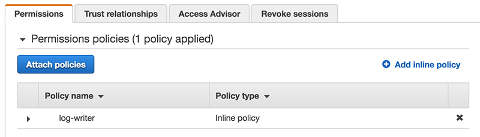
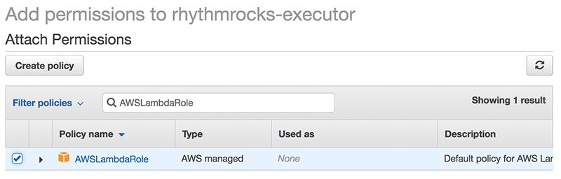

# More is better: Lambdas calling Lambdas

It's clear that you will often want one lambda to call another. How do you do that?

Let's get our `rhythmrocks` lambda making a call to another lambda.

# First, a new role

First, a little administration. Recall the executor role our `rhythmrocks` lambda was given earlier? 


To call another lambda you'll need to give that executor another role allowing it to call other lambdas. Jump to the IAM service, where you'll see a link to `Roles`. Click into that, then select the `rhythmrocks` executor. You'll see this:



We're going to attach a new policy to this executor. Click `Add Policies` and add `AWSLambdaRole` to the `rhythmrocks` executor:



`Attach Policy` and we're done.

# Now, anotherlambda

To create another lambda function we need another folder, like we did before. Create that folder with the name `anotherlambda`, run `npminit` in it, and create a `lambda.js` file with the following code:

```
exports.handler = (event, context) => {
	context.succeed(event);
};
```

Remember how lambdas are triggered by events? We'll unpack this shortly, but for now note that `anotherlambda` will acta as an identity function simply reflecting whatever event info it is sent. `claudia create` the new lambda, and `claudia test-lambda`. You should see this:

```
{
  "StatusCode": 200,
  "ExecutedVersion": "$LATEST",
  "Payload": "{}"
}
```

Since we didn't send an event the payload is empty, which is expected. Let's fix that.

```
claudia test-lambda --profile claudia --event ../rhythmrocks/event.json
```

# Making the call

Return to your `rhythmrocks` folder. Update the `lambda.js` file to the following:

```
const aws = require('aws-sdk');
const lambda = new aws.Lambda({
    region: 'us-east-1'
});

exports.handler = (event, context, callback) => new Promise((resolve, reject) => {
    lambda.invoke({
        FunctionName: 'anotherlambda',
        Payload: JSON.stringify({
            something: "here"
        })
    }, (error, data) => error ? reject(error) : resolve(data.Payload));
});
```

Invoking a remote lambda will be asynchronous, so here we use a `Promise` to ensure that our `rhythmrocks` lambda doesn't return until it has received a response from `anotherlambda`. Within that `Promise` you need only specify the name of the lambda function you want to call (that was easy!), and the `Payload` you will be sending (here stringified -- you can't send a plain object).

Note that we're using a `node` module here, the AWS official library. You need to install that as usual with `node`, in the `rhythmrocks` package folder:

```
npm install aws-sdk
claudia update --profile claudia
```

That's it -- `claudia` will worry about building the lambda package with required dependencies.

Go ahead and try it out: `claudia test-lambda --profile claudia`. You should see the payload reflected back to you. It worked!

Neato. Now you can spin up functions in the cloud and have them communicate with one another. 

Another very popular way to trigger functions is one that you probably use every day -- creating an web-enabled API. Amazon offers `APIGateway` for this purpose, and `claudia` makes working with `APIGateway` super easy. [Let's set that up](./api_gateway.md)


